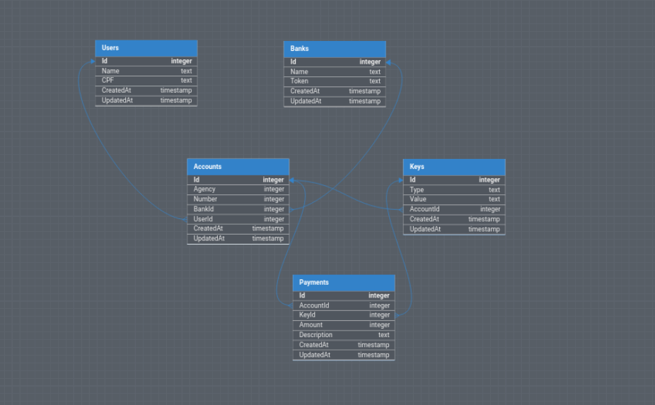

# API-PIX

Este projeto consiste numa API que simula o papel do Banco Central no PIX, os usuários da API seriam as Payment Service Provider (PSP) que utilizam para criar chaves pix e pagamentos.

## Documentação 📚

URL da Documentação: `https://app.swaggerhub.com/apis-docs/PDROCHA03/API-Pix/1.0.0`;

## Tecnologias 🔧

Para a construção do projeto foi utilizado as seguintes tecnologias:

- .Net: v8.0.202
- Entity Framework Core: v8.0.2
- PostgreSQL
- RabbitMQ
- Docker
- Grafana K6
- Knex

## Entidades do Banco de Dados 🗄️

## Instalação e Execução 🚀

Para rodar o projeto localmente, siga os seguinter passos:

1. Clone o repositório: `git clone https://github.com/pablodru/pix-stone.git`;
2. Acesse o diretório do projeto: `cd pix-stone`;
3. Construa e inicie os contâineres docker: `docker-compose up -d`:
4. Depois disso, a aplicação estará disponível em: `http://localhost:8080`;

Nota: Não existem rotas de criação de User e Bank, certifique da criação no banco de dados.

## Filas e Rabbitmq 🐇

As rotas POST /payments e /concilliation fazem uso do serviço de mensageria Rabbitmq e utilizam consumers em outros repositórios. Acesse os repositórios abaixo e siga os passos para execução:

- POST /payments: `https://github.com/pablodru/pix-stone-payment-consumer`;
- POST /concilliation: `https://github.com/pablodru/pix-stone-concilliation-consumer`;

## Execução dos testes de carga e seed 🛰️

- Para rodar a seed e popular o banco de dados:

1. A partir da pasta do projeto, entre na pasta .k6;
2. Acesse o diretório do k6: `cd .k6` (PATH: pix-stone/.k6);
3. Instale as depêndencias com `npm i`;
4. Certifique-se do n° de entidades que deseja criar no arquivo seed.js;
5. Rode o script do seed `npm run seed`;

- Para executar os testes de carga:

1. A partir da pasta do projeto, entre na pasta .k6 e depois na pasta tests;
2. Acesse o diretório de tests: `cd .k6/tests`;
  - Rode os teste de POST /keys com: `k6 run postKeysTest.js`;
  - Rode os teste de GET /keys com: `k6 run getKeyTest.js`;
  - Rode os teste de POST /payments com: `k6 run postPaymentTest.js`;

